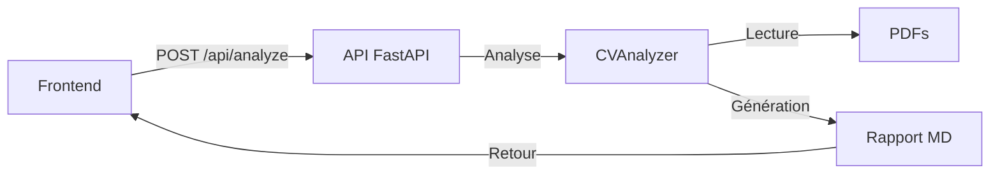

# 🚀 Guide Développeur - CV Classifier Pro

## 📚 Table des Matières
1. [Vue d'ensemble](#vue-densemble)
2. [Structure détaillée](#structure-détaillée)
3. [Guide Backend (Python)](#guide-backend-python)
4. [Guide Frontend (React)](#guide-frontend-react)
5. [Démarrage du projet](#démarrage-du-projet)
6. [Guide de débogage](#guide-de-débogage)
7. [Exemples de code](#exemples-de-code)

## Vue d'ensemble

CV Classifier Pro est une application d'analyse de CV qui combine :
- Backend : Python (FastAPI + PyPDF2)
- Frontend : React (Material-UI)

### Flux de données


## Structure détaillée

```
CV-Classifier-Pro/
├── src/
│   ├── services/              # Backend Python
│   │   ├── cv_analyzer.py     # Analyse des CVs
│   │   └── api.py            # API FastAPI
│   ├── components/           # Frontend React
│   │   ├── App.jsx           # Composant racine
│   │   ├── CVAnalyzerForm    # Formulaire
│   │   └── AnalysisReport    # Affichage rapport
│   └── main.jsx             # Point d'entrée React
├── requirements.txt         # Dépendances Python
└── package.json            # Dépendances Node.js
```

## Guide Backend (Python)

### 1. CVAnalyzer (`src/services/cv_analyzer.py`)

```python
class CVAnalyzer:
    """
    Classe principale d'analyse des CVs.
    
    Attributs:
        pdf_folder (Path): Chemin vers le dossier des CVs
        keywords (dict): Mots-clés et leurs pondérations
        failed_conversions (list): Liste des erreurs de conversion
    """
    
    def __init__(self, pdf_folder: str, keywords: Dict[str, float]):
        """
        Initialise l'analyseur.
        
        Args:
            pdf_folder: Chemin vers le dossier contenant les CVs
            keywords: Dict de mots-clés avec leurs pondérations
                     Exemple: {"Python": 30, "JavaScript": 20}
        
        Raises:
            ValueError: Si la somme des pondérations != 100%
        """
```

#### Méthodes principales

1. `extract_text_from_pdf(self, pdf_path: Path) -> str`:
   ```python
   # Utilisation :
   text = analyzer.extract_text_from_pdf(pdf_path)
   
   # Comment ça marche :
   # 1. Ouvre le PDF avec PyPDF2
   # 2. Extrait le texte page par page
   # 3. Nettoie le texte (espaces, retours ligne)
   # 4. Gère les erreurs de conversion
   ```

2. `count_keywords(self, text: str) -> Dict[str, int]`:
   ```python
   # Utilisation :
   keyword_counts = analyzer.count_keywords(text)
   
   # Retourne :
   # {
   #   "Python": 5,    # Trouvé 5 fois
   #   "JavaScript": 2 # Trouvé 2 fois
   # }
   ```

3. `generate_markdown_report(self, results: List[ScoredCV])`:
   ```python
   # Génère un rapport structuré :
   # 1. Résumé avec statistiques
   # 2. Top 3 des candidats
   # 3. Tableau détaillé
   # 4. Section erreurs
   ```

### 2. API FastAPI (`src/services/api.py`)

```python
@app.post("/api/analyze")
async def analyze_cvs(request: AnalysisRequest):
    """
    Point d'entrée principal de l'API.
    
    Request Body:
    {
        "folderPath": "chemin/vers/cvs",
        "keywords": {
            "Python": 30,
            "JavaScript": 20
        }
    }
    
    Returns:
    {
        "report": "contenu_markdown"
    }
    """
```

#### Gestion des erreurs
```python
try:
    analyzer = CVAnalyzer(request.folderPath, request.keywords)
    results = analyzer.analyze_cvs()
except ValueError as e:
    raise HTTPException(status_code=400, detail=str(e))
except Exception as e:
    raise HTTPException(status_code=500, detail=str(e))
```

## Guide Frontend (React)

### 1. Composant App (`src/components/App.jsx`)

```jsx
function App() {
  const [report, setReport] = useState(null);
  
  // Gestion du rapport
  const handleAnalysisComplete = (reportData) => {
    setReport(reportData);
  };
  
  return (
    <Container>
      <CVAnalyzerForm onAnalysisComplete={handleAnalysisComplete} />
      {report && <AnalysisReport report={report} />}
    </Container>
  );
}
```

### 2. Formulaire (`src/components/CVAnalyzerForm.jsx`)

```jsx
function CVAnalyzerForm({ onAnalysisComplete }) {
  // État local
  const [folderPath, setFolderPath] = useState('');
  const [keywords, setKeywords] = useState([
    { keyword: '', weight: '' }
  ]);
  
  // Validation
  const validateForm = () => {
    const totalWeight = keywords.reduce(
      (sum, k) => sum + Number(k.weight), 
      0
    );
    return totalWeight === 100;
  };
  
  // Soumission
  const handleSubmit = async (e) => {
    e.preventDefault();
    if (!validateForm()) return;
    
    try {
      const response = await fetch('/api/analyze', {
        method: 'POST',
        headers: {
          'Content-Type': 'application/json',
        },
        body: JSON.stringify({
          folderPath,
          keywords: Object.fromEntries(
            keywords.map(k => [k.keyword, Number(k.weight)])
          ),
        }),
      });
      
      const data = await response.json();
      onAnalysisComplete(data.report);
    } catch (error) {
      console.error('Erreur:', error);
    }
  };
}
```

### 3. Affichage du rapport (`src/components/AnalysisReport.jsx`)

```jsx
function AnalysisReport({ report }) {
  return (
    <Box>
      <ReactMarkdown
        remarkPlugins={[remarkGfm]}
        components={{
          // Personnalisation du rendu
          table: ({ node, ...props }) => (
            <Table {...props} />
          ),
          // etc.
        }}
      >
        {report}
      </ReactMarkdown>
    </Box>
  );
}
```

## Démarrage du projet

1. Installation des dépendances :
```bash
# Backend
pip install -r requirements.txt

# Frontend
npm install
```

2. Configuration de l'environnement :
```bash
# Créer un dossier pour les CVs
mkdir cvs

# Vérifier les permissions
chmod 755 cvs  # Linux/Mac
```

3. Lancement des serveurs :
```bash
# Terminal 1 - Backend
uvicorn src.services.api:app --reload --port 8000

# Terminal 2 - Frontend
npm run dev
```

## Guide de débogage

### Backend

1. Logs FastAPI :
```python
# Dans api.py
import logging

logging.basicConfig(level=logging.DEBUG)
logger = logging.getLogger(__name__)

@app.post("/api/analyze")
async def analyze_cvs(request: AnalysisRequest):
    logger.debug(f"Analyzing CVs in: {request.folderPath}")
    # ...
```

2. Débogage PyPDF2 :
```python
# Dans cv_analyzer.py
def extract_text_from_pdf(self, pdf_path: Path) -> str:
    try:
        with open(pdf_path, 'rb') as file:
            reader = PyPDF2.PdfReader(file)
            print(f"PDF Pages: {len(reader.pages)}")
            # ...
    except Exception as e:
        print(f"Error reading {pdf_path}: {e}")
```

### Frontend

1. Console du navigateur :
```javascript
// Dans CVAnalyzerForm.jsx
console.log('Keywords:', keywords);
console.log('Form Data:', formData);
```

2. Débogage des requêtes :
```javascript
// Intercepter les requêtes
fetch('/api/analyze', {
  // ...
}).then(response => {
  console.log('Response:', response);
  return response.json();
}).catch(error => {
  console.error('Error:', error);
});
```

## Exemples de code

### 1. Ajout d'un nouveau critère d'analyse

```python
# Dans cv_analyzer.py
def analyze_experience(self, text: str) -> int:
    """Analyse l'expérience professionnelle."""
    experience_patterns = [
        r'\d+\s+ans?\s+d\'expérience',
        r'expérience\s+de\s+\d+\s+ans?'
    ]
    
    for pattern in experience_patterns:
        matches = re.finditer(pattern, text, re.IGNORECASE)
        for match in matches:
            # Extraire le nombre d'années
            years = int(re.search(r'\d+', match.group()).group())
            return years
    return 0

# Utilisation dans analyze_cvs
def analyze_cvs(self):
    results = []
    for pdf_file in self.pdf_folder.glob('*.pdf'):
        text = self.extract_text_from_pdf(pdf_file)
        keyword_counts = self.count_keywords(text)
        experience_years = self.analyze_experience(text)
        
        # Ajuster le score selon l'expérience
        base_score = self.calculate_score(keyword_counts)
        experience_bonus = min(experience_years * 2, 20)  # Max 20%
        final_score = base_score + experience_bonus
        
        results.append(ScoredCV(
            filename=pdf_file.name,
            score=final_score,
            found_keywords=keyword_counts,
            experience_years=experience_years
        ))
    return sorted(results, key=lambda x: x.score, reverse=True)
```

### 2. Personnalisation du rapport

```python
def generate_markdown_report(self, results: List[ScoredCV]) -> str:
    """
    Génère un rapport personnalisé avec graphiques ASCII.
    """
    report = [
        "# 📊 Analyse des CV\n",
        self._generate_summary(results),
        self._generate_charts(results),
        self._generate_detailed_results(results)
    ]
    return "\n".join(report)

def _generate_charts(self, results: List[ScoredCV]) -> str:
    """
    Génère des graphiques ASCII pour visualiser les scores.
    """
    chart = ["## 📈 Distribution des scores\n```"]
    max_score = max(cv.score for cv in results)
    for cv in results:
        bar_length = int((cv.score / max_score) * 20)
        chart.append(f"{cv.filename[:20]:<20} {'█' * bar_length} {cv.score}%")
    chart.append("```\n")
    return "\n".join(chart)
```

### 3. Ajout d'une fonctionnalité de prévisualisation

```jsx
// Dans CVAnalyzerForm.jsx
function CVPreview({ file }) {
  const [preview, setPreview] = useState('');
  
  useEffect(() => {
    if (!file) return;
    
    // Appel à l'API pour prévisualiser
    fetch('/api/preview', {
      method: 'POST',
      body: JSON.stringify({ path: file })
    })
    .then(response => response.json())
    .then(data => setPreview(data.preview));
  }, [file]);
  
  return (
    <Paper elevation={3} sx={{ p: 2, mt: 2 }}>
      <Typography variant="h6">
        Prévisualisation
      </Typography>
      <pre>{preview}</pre>
    </Paper>
  );
}
```

## Bonnes pratiques

1. **Backend** :
   - Validez toujours les entrées utilisateur
   - Gérez proprement les erreurs
   - Utilisez des types avec Pydantic
   - Documentez vos fonctions

2. **Frontend** :
   - Utilisez des composants réutilisables
   - Gérez les états avec useState/useEffect
   - Validez les formulaires
   - Ajoutez des retours utilisateur

3. **Général** :
   - Suivez un style de code cohérent
   - Commentez le code complexe
   - Testez les cas limites
   - Gardez les logs pertinents

## Ressources utiles

1. **Documentation** :
   - [FastAPI](https://fastapi.tiangolo.com/)
   - [PyPDF2](https://pypdf2.readthedocs.io/)
   - [React](https://reactjs.org/)
   - [Material-UI](https://mui.com/)

2. **Outils** :
   - VS Code avec extensions Python et React
   - Postman pour tester l'API
   - React Developer Tools
   - Python Debugger (pdb)

## FAQ Développement

1. **Q**: Comment ajouter un nouveau format de CV ?
   **R**: Créez une nouvelle méthode d'extraction dans CVAnalyzer :
   ```python
   def extract_text_from_docx(self, path: Path) -> str:
       # Utiliser python-docx
       pass
   ```

2. **Q**: Comment améliorer l'analyse des mots-clés ?
   **R**: Utilisez des techniques NLP :
   ```python
   from nltk.tokenize import word_tokenize
   from nltk.stem import WordNetLemmatizer
   
   def preprocess_text(self, text: str) -> str:
       tokens = word_tokenize(text.lower())
       lemmatizer = WordNetLemmatizer()
       return " ".join(lemmatizer.lemmatize(token) for token in tokens)
   ```

3. **Q**: Comment gérer les gros fichiers PDF ?
   **R**: Utilisez le streaming et le traitement asynchrone :
   ```python
   async def process_large_pdf(self, path: Path):
       # Traitement par morceaux
       pass
   ```
